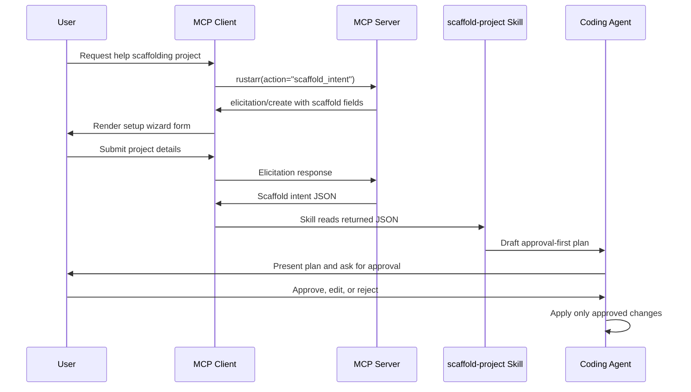

# Scaffold Intent Handoff Spec

## Status

Draft / implemented in template skeleton.

## Purpose

`rustarr` provides an MCP elicitation setup wizard that helps a user describe the server they want to scaffold without granting the tool permission to mutate files directly.

The wizard returns structured JSON. A plugin skill then reads that JSON and creates an approval-first implementation plan. The user remains in control because normal editor/plugin permissions govern any later file edits.

## Goals

- Collect scaffold requirements through MCP elicitation when the client supports it.
- Return machine-readable scaffold intent JSON.
- Keep the MCP tool side-effect free: no file writes, deletes, commits, or pushes.
- Use a plugin skill to convert intent JSON into a concrete implementation plan.
- Require explicit user approval before file mutations.
- Encode the surface policy:
  - upstream-client servers require MCP + CLI
  - application/platform servers require API + CLI + MCP + Web

## Non-goals

- Automatically rewriting the repository from inside the MCP tool.
- Generating a complete scaffold in one unreviewed step.
- Treating REST/Web as mandatory for upstream-client servers.
- Replacing normal user/editor permission prompts.

## Actors

| Actor | Role |
|---|---|
| User | Describes the target project and approves/rejects plans. |
| MCP client | Displays elicitation UI and returns user input to the server. |
| MCP server | Runs `scaffold_intent`, validates/normalizes input, returns JSON. |
| Plugin skill | Reads the JSON and drafts an approval-first scaffold plan. |
| Coding agent/editor | Applies approved changes through normal file-edit permissions. |

## High-level flow



## MCP action

### Name

`scaffold_intent`

### Surface

MCP-only.

### Scope

`rustarr:read` in the template. Scaffolded projects should rename this to the service read scope, for rustarr `unraid:read`.

### Rationale for MCP-only

`scaffold_intent` is an explicit exception to the normal MCP + CLI business-action parity rule.

This action depends on two MCP/client capabilities that do not translate cleanly to CLI:

1. MCP elicitation (`peer.elicit::<ScaffoldIntentInput>(...)`) for a client-rendered setup form.
2. Plugin skill handoff (`scaffold-project`) for turning returned JSON into an approval-first plan inside the user's agent/editor permission model.

A CLI command could collect similar fields, but it would not exercise MCP elicitation or plugin skill selection, which are the point of this setup wizard. For that reason, this remains MCP-only unless a future CLI command is explicitly scoped as a separate JSON planner, not a parity requirement.

## Elicitation fields

The intent should stay lightweight. The wizard asks enough to choose the scaffold shape, runtime defaults, optional plugins, and documentation inputs; it does not try to inventory every action up front.

| Field | Type | Purpose | Rustarr |
|---|---|---|---|
| `display_name` | string | Human-readable project name | `Unraid MCP` |
| `crate_name` | string | Cargo package name | `unraid-mcp` |
| `binary_name` | string | CLI/MCP server binary name | `unraid` |
| `server_category` | string | Surface category | `upstream-client` or `application-platform` |
| `env_prefix` | string | Environment variable prefix | `UNRAID` |
| `auth_kind` | string | Upstream auth type | `none`, `api-key`, `bearer`, `oauth`, `both`, `other` |
| `host` | string | Default bind host | `127.0.0.1` |
| `port` | integer | Default HTTP port | `3100` |
| `mcp_transport` | string | MCP transport mode | `stdio`, `http`, or `dual` |
| `mcp_primitives` | list | MCP primitives to scaffold | `tools`, `resources`, `prompts`, `elicitation` |
| `deployment` | string | Deployment scaffolding to include | `none`, `systemd`, or `docker` |
| `plugins` | list | Plugin surfaces to scaffold | `claude`, `codex`, `gemini`; accepts all, none, or any subset |
| `publish_mcp` | boolean | Whether to scaffold MCP registry publishing via `server.json` | `true` |
| `crawl_docs` | object | Optional docs/research inputs for Axon crawling | URLs, repos, or search topics |

## Returned JSON contract

The action returns a JSON object with `kind = "rustarr_scaffold_intent"` and `schema_version = 1`.

Machine-readable contract: [`docs/contracts/scaffold-intent.schema.json`](../contracts/scaffold-intent.schema.json).

Checked-in rustarrs:

- [`docs/contracts/rustarrs/scaffold-intent-upstream-client.json`](../contracts/rustarrs/scaffold-intent-upstream-client.json)
- [`docs/contracts/rustarrs/scaffold-intent-application-platform.json`](../contracts/rustarrs/scaffold-intent-application-platform.json)

### Policy/runtime fields

These fields are part of the core scaffold decision:

| Field | Accepted values | Notes |
|---|---|---|
| `required_surfaces` | `mcp`, `cli`, `api`, `web` | Derived from `server_category`; upstream-client uses MCP + CLI, application-platform uses API + CLI + MCP + Web. |
| `runtime.host` | string | Default bind host. |
| `runtime.port` | integer | Default HTTP port. |
| `runtime.mcp_transport` | `stdio`, `http`, `dual` | `dual` scaffolds both stdio and Streamable HTTP. |
| `mcp_primitives` | `tools`, `resources`, `prompts`, `elicitation` | User-selected primitives to scaffold. |
| `deployment` | `none`, `systemd`, `docker` | Deployment scaffolding to include. |
| `plugins` | `claude`, `codex`, `gemini` | Accepts all, none, or any subset. |
| `publish_mcp` | boolean | If true, scaffold/update `server.json` for MCP registry publishing. |
| `crawl_docs` | object | Optional inputs for Axon crawling: `urls`, `repos`, and `search_topics`. |

### Rustarr: upstream-client server

```json
{
  "kind": "rustarr_scaffold_intent",
  "schema_version": 1,
  "server_category": "upstream-client",
  "required_surfaces": ["mcp", "cli"],
  "project": {
    "display_name": "Unraid MCP",
    "crate_name": "unraid-mcp",
    "binary_name": "unraid",
    "service_name": "unraid",
    "env_prefix": "UNRAID"
  },
  "upstream": {
    "base_url_env": "UNRAID_API_URL",
    "auth_kind": "api-key"
  },
  "runtime": {
    "host": "127.0.0.1",
    "port": 3100,
    "mcp_transport": "dual"
  },
  "mcp_primitives": ["tools", "resources", "prompts", "elicitation"],
  "deployment": "none",
  "plugins": ["claude", "codex"],
  "publish_mcp": true,
  "crawl_docs": {
    "urls": ["https://docs.unraid.net/"],
    "repos": [],
    "search_topics": ["Unraid API authentication"]
  },
  "handoff": {
    "recommended_skill": "scaffold-project",
    "instructions": "Create an approval-first scaffold plan from this JSON. Do not mutate files until the user approves the plan."
  },
  "policy": {
    "business_action_minimum_surfaces": ["mcp", "cli"],
    "upstream_client_surfaces": ["mcp", "cli"],
    "application_platform_surfaces": ["api", "cli", "mcp", "web"]
  }
}
```

### Rustarr: application/platform server

```json
{
  "kind": "rustarr_scaffold_intent",
  "schema_version": 1,
  "server_category": "application-platform",
  "required_surfaces": ["api", "cli", "mcp", "web"],
  "project": {
    "display_name": "Lab Gateway",
    "crate_name": "lab-gateway",
    "binary_name": "lab",
    "service_name": "lab",
    "env_prefix": "LAB"
  },
  "upstream": {
    "base_url_env": "LAB_API_URL",
    "auth_kind": "both"
  },
  "runtime": {
    "host": "0.0.0.0",
    "port": 3100,
    "mcp_transport": "http"
  },
  "mcp_primitives": ["tools", "resources", "prompts", "elicitation"],
  "deployment": "docker",
  "plugins": ["claude", "codex", "gemini"],
  "publish_mcp": true,
  "crawl_docs": {
    "urls": [],
    "repos": ["https://github.com/rustarr/lab-sdk"],
    "search_topics": ["Lab Gateway API runs artifacts"]
  },
  "handoff": {
    "recommended_skill": "scaffold-project",
    "instructions": "Create an approval-first scaffold plan from this JSON. Do not mutate files until the user approves the plan."
  },
  "policy": {
    "business_action_minimum_surfaces": ["mcp", "cli"],
    "upstream_client_surfaces": ["mcp", "cli"],
    "application_platform_surfaces": ["api", "cli", "mcp", "web"]
  }
}
```

## Failure and fallback responses

The action must return graceful JSON for expected elicitation outcomes.

| Condition | Response status field | Behavior |
|---|---|---|
| User submits form | omitted | Return scaffold intent JSON. |
| User submits no input | `no_input` | Return explanatory JSON; no mutation. |
| User declines | `declined` | Return explanatory JSON; no mutation. |
| User cancels | `cancelled` | Return explanatory JSON; no mutation. |
| Client lacks elicitation | `elicitation_not_supported` | Return fallback instructions for manually collecting the same JSON shape. |
| Unexpected elicitation error | error result | Log and return an MCP tool error. |

## Skill handoff

The `scaffold-project` skill is responsible for turning scaffold intent JSON into a plan.

Location:

```text
plugins/rustarr/skills/scaffold-project/SKILL.md
```

The skill must:

1. Read the JSON returned by `scaffold_intent`.
2. Preserve the selected server category and required surfaces.
3. Draft a plan in this order:
   1. Summary
   2. Surface decision
   3. Rename map
   4. Runtime/plugin/deployment choices
   5. Files to change
   6. Tests/validation
   7. Approval checkpoint
4. Ask for approval before mutations.
5. Apply only approved changes through normal coding-agent file-edit tools.

The skill must not treat returned JSON as permission to mutate files.

## Surface policy

Every business action must have MCP + CLI parity. `scaffold_intent` is not treated as a business action for parity purposes; it is a setup wizard that exists specifically to combine MCP elicitation with plugin skill handoff.

| Server category | Required surfaces | Rustarrs |
|---|---|---|
| `upstream-client` | MCP + CLI | `unrust`, `rustifi`, `rustify`, `rustscale`, `apprise` |
| `application-platform` | API + CLI + MCP + Web | `axon`, `lab`, `syslog` |

Allowed exceptions:

- MCP-only protocol interactions may omit CLI if no non-interactive equivalent exists. The reason must be documented.
- CLI-only operational commands (`serve`, `mcp`, `doctor`, `watch`, `setup`) are not business actions and do not need MCP equivalents.

## Approval boundary

The approval boundary is the key safety guarantee.

`scaffold_intent` may:

- ask questions through elicitation
- normalize user answers
- return JSON

`scaffold_intent` must not:

- write files
- delete files
- run scaffold mutations
- commit changes
- push changes
- install dependencies
- call external project-generation services

The coding agent may mutate files only after the user approves the plan produced from the JSON.

## Implementation mapping

| Concern | File |
|---|---|
| Action metadata and parser | `src/actions.rs` |
| Elicitation implementation | `src/mcp/tools.rs` |
| MCP schema/action enum | `src/mcp/schemas.rs` via `action_names()` |
| Generated schema docs | `docs/MCP_SCHEMA.md` |
| Schema docs generator descriptions | `scripts/check-schema-docs.py` |
| Tool skill reference | `plugins/rustarr/skills/rustarr/SKILL.md` |
| Handoff skill | `plugins/rustarr/skills/scaffold-project/SKILL.md` |
| Web API explorer metadata | `apps/web/lib/template.ts` |

## Validation requirements

After changing this flow, run:

```bash
cargo fmt --package rustarr
cargo test --lib
just schema-docs-check
just scaffold-contract-check
just validate-plugin
pnpm --dir apps/web check
pnpm --dir apps/web typecheck
```

If generated MCP schema docs drift, run:

```bash
just schema-docs
```

## OpenAPI serving decision

For application/platform servers that scaffold the API surface, expose the generated REST schema at `GET /openapi.json` and keep `docs/generated/openapi.json` current with `just openapi`. For upstream-client MCP + CLI servers, keeping the generated file in docs is sufficient unless the user explicitly selects an API/Web surface.

## Future extensions

Possible additions that preserve the safety boundary:

- Add a CLI command that reads scaffold intent JSON and prints the same approval-first plan.
- Add a dry-run planner command that validates intent JSON against `docs/contracts/scaffold-intent.schema.json` without editing files.
- Add optional artifact export, for rustarr writing intent JSON only after explicit user approval.
